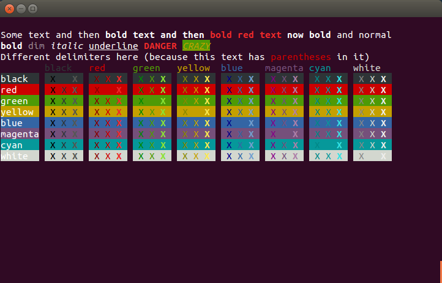

# antsy

[](https://raw.githubusercontent.com/willyg302/antsy/master/LICENSE)

Sweet interpolated ANSI strings

## Installing

antsy is just a `pip install git+https://github.com/willyg302/antsy.git@master` away.

## The Demo Page

Let's see what antsy can do! First, the code:

```python
import sys
import antsy

print(antsy.decorate('Some text and then (bold bold text and then (fg/red bold red text) now bold) and normal'))
print(antsy.decorate('(b bold) (d dim) (i italic) (u underline) (b,fg/red DANGER) (bg/green,i,u,fg/yellow CRAZY)'))
print(antsy.decorate('Different delimiters here (because this text has [fg/red parentheses] in it)', start='[', end=']'))
# The table
print(antsy.decorate(''.join(['        '] + ['(fg/{} {})'.format(c, c.ljust(8)) for c in antsy.COLORS])))
for bgc in antsy.COLORS:
	sys.stdout.write(antsy.decorate('(bg/{} {}) '.format(bgc, bgc.ljust(7))))
	for fgc in antsy.COLORS:
		sys.stdout.write(antsy.decorate('(bg/{}  (fg/{} (d X) X (b X)) ) '.format(bgc, fgc)))
	sys.stdout.write('\n')
```

And now, the glorious demo page:



## Usage

By now I'm sure you're wondering, "Cool! So just how do I *use* antsy?" The answer is rather simple: after you `import antsy`, just write some strings and pass them along to `antsy.decorate()`. The returned strings will be beautifully ANSI-fied (if your terminal supports ANSI).

### The Basics

The real trick, of course, is in how you write those strings. Let's say I wanted to print a big red warning followed by some less scary text for users of my program, something like this:

```python
s = 'OH NOES! You done goofed!'
```

The first step is to surround the text you want ANSI-fied with parentheses:

```python
s = '(OH NOES!) You done goofed!'
```

Then you write what is called a *control sequence* at the very beginning inside the parentheses, followed by a space:

```python
s = '(bold,fg/red OH NOES!) You done goofed!'
print(antsy.decorate(s))
```

Boom, done!

> **Psst...** If this looks a lot like [Lisp](http://en.wikipedia.org/wiki/Lisp_%28programming_language%29) to you, that's because it sort of is! antsy was partly inspired by Peter Norvig's [excellent article](http://norvig.com/lispy.html) on creating a Lisp interpreter in Python.

### Control Sequences

A control sequence defines how you want text within that set of parentheses to be formatted. In our above example, we wanted the text to be bold and red, so we used the control sequence `bold,fg/red`.

`bold` and `fg` are known as *control codes*; there may be more than one code in a sequence, separated by commas. A control code may have arguments, split by slashes. For example, to set the background color to magenta we use the code `bg`, with the argument `magenta`: `bg/magenta`.

So how would you set the background to red and the foreground to bold italicized cyan? That's right, `bg/red,fg/cyan,bold,italic`.

Note that for the sake of brevity some control codes can be abbreviated, so the previous example could have also been written as `bg/red,fg/cyan,b,i`.

### Supported Control Codes

Code | Abbrev. | Arguments | Description
--- | --- | --- | ---
`normal` | `n` | | A no-op (passes text through unchanged)
`bold` | `b` | | Makes text bold
`dim` | `d` | | Makes text dim
`italic` | `i` | | Italicizes text
`underline` | `u` | | Underlines text
`fg` | | color | Sets the foreground color
`bg` | | color | Sets the background color

#### Colors

- black
- red
- green
- yellow
- blue
- magenta
- cyan
- white

### Custom Delimiters

Normally antsy uses parentheses as delimiters, but what if you have a string with parentheses inside it? In these cases, you can pass the extra parameters `start` and `end` to `antsy.decorate()` to define custom delimiters with which to split your string. For example:

```python
s = 'I find regex quite odd (^i don\'t you?$)'
print(antsy.decorate(s, start='^', end='$'))
```

Naturally, the delimiters must be different, or else an error will be thrown.

## Testing

Call tests with `python test.py` to run tests and print the demo page for manual verification. You may also call `python setup.py test`, but this does not print the demo.
